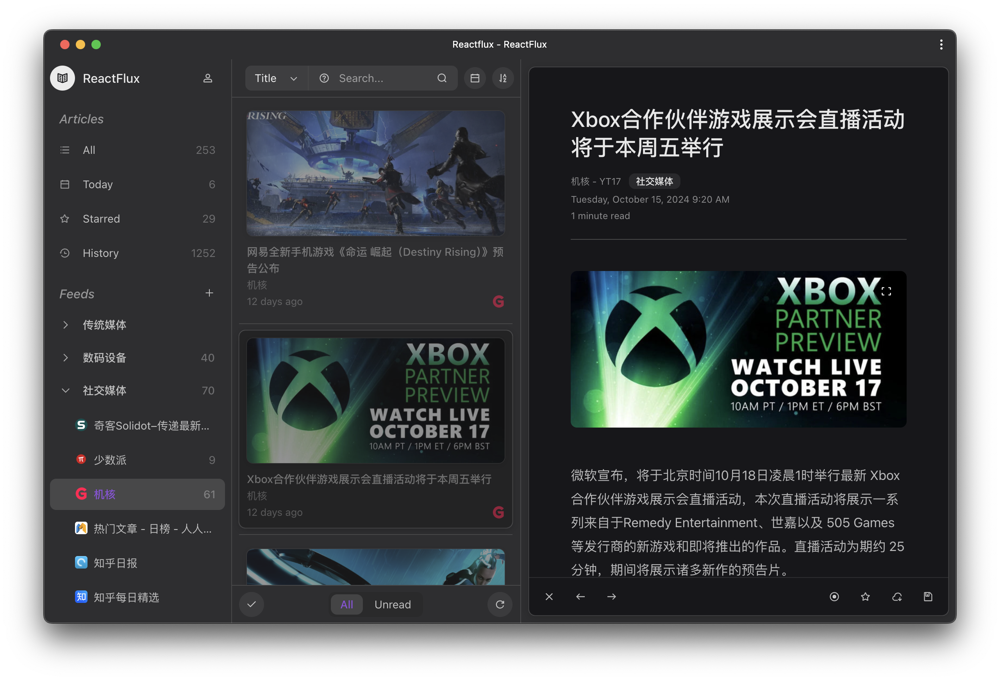

# ReactFlux

Lea este texto en otros idiomas: [English](README.md), [Français](README.fr-FR.md), [简体中文](README.zh-CN.md)

## Descripción general

ReactFlux es una interfaz web de terceros para [Miniflux](https://github.com/miniflux/v2), cuyo objetivo es proporcionar una experiencia de lectura más fácil de usar.

Las funcionalidades clave incluyen:

- Diseño de interfaz moderna
- Diseño adaptable a todos los dispositivos (responsivo)
- Admite modo oscuro y temas personalizados
- Búsqueda de artículos y suscripciones con una sintaxis similar a Google
- Filtrar artículos por fecha de publicación
- Gestión de feed y de grupos de feeds
- Atajos de teclado (personalizables)
- Marca automáticamente los artículos como leidos al desplazarlos al hacer scroll
- Actualización por lotes del host de URL de suscripción filtradas (útil para reemplazar instancias de RSSHub)
- Actualización por lotes de suscripciones recientemente falladas
- Elimina artículos duplicados por hash, título o URL al cargar la lista
- Disponible en varios idiomas (incluye: Inglés / Español / 简体中文)
- Guardar artículo en servicios de terceros
- Resaltado de sintaxis para bloques de código
- Otras características esperando que las descubras...

## Demostración en línea y capturas de pantalla

Pruebe ReactFlux con nuestra [instancia de demostración en línea](https://reactflux.pages.dev).

Vea cómo se ve ReactFlux en diferentes temas:




## Inicio Rápido

1. Asegúrese de tener una instancia funcional de Miniflux
2. Use directamente nuestra [instancia de demostración en línea](https://reactflux.pages.dev) o despliegue ReactFlux utilizando uno de los métodos a continuación
3. Inicie sesión usando su nombre de usuario y contraseña de Miniflux o la clave API (recomendado)

## Despliegue

### Páginas de Cloudflare

ReactFlux está construido con React y genera un conjunto de archivos web estáticos después de la compilación, que se pueden implementar directamente en Cloudflare Pages.

Puede desplegarlo en Cloudflare Pages seleccionando `Framework preset` como `Create React App`.

### Usando archivos preconstruidos

Puede descargar los archivos preconstruidos de la rama `gh-pages` y desplegarlos en cualquier servicio de alojamiento estático que soporte aplicaciones de una sola página (SPA).

Asegúrese de configurar la reescritura de URL para redirigir todas las solicitudes a `index.html`.

Si está desplegando usando Nginx, es posible que necesite agregar la siguiente configuración:

```nginx
location / {
    try_files $uri $uri/ /index.html;
}
```

### Vercel

[](https://vercel.com/import/project?template=https://github.com/electh/ReactFlux)

### Zeabur

[](https://zeabur.com/templates/OKXO3W)

### Docker

```bash
docker run -p 2000:2000 electh/reactflux
```

## Guía de Traducción

Para ayudarnos a traducir ReactFlux a su idioma, por favor contribuya a la carpeta `locales` y envíe una solicitud de extracción.

Además, necesita agregar un archivo README para el idioma respectivo y referenciarlo en todos los archivos README existentes.

También debe modificar partes del código fuente para incluir los paquetes de idiomas i18n para `Arco Design` y `Day.js`.

Para cambios detallados, por favor consulte las modificaciones en [PR #120](https://github.com/electh/ReactFlux/pull/120).

### Traductores Actuales

- Español by [Victorhck](https://github.com/victorhck)
- Français by [MickGe](https://github.com/MickGe)
- 简体中文 by [Neko Aria](https://github.com/NekoAria)

## Colaboradores

> ¡Gracias a todos los colaboradores que han hecho este proyecto más increíble!

<a href="https://github.com/electh/ReactFlux/graphs/contributors">
  
</a>

Hecho con [contrib.rocks](https://contrib.rocks).

## Historial de estrellas en GitHub

[](https://starchart.cc/electh/ReactFlux)
