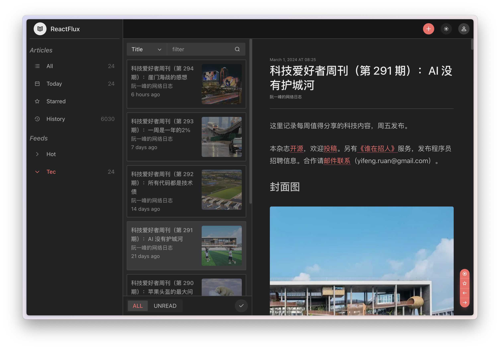
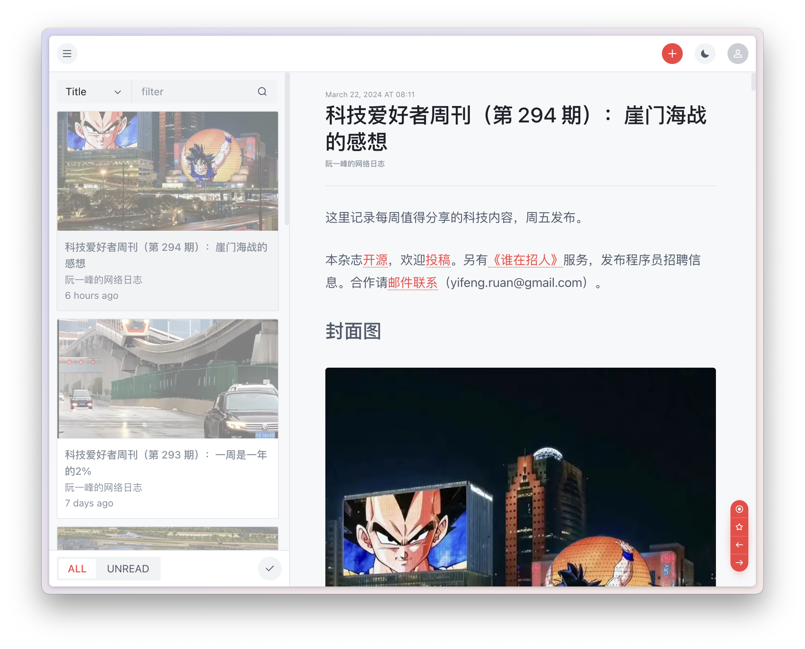

## ReactFlux

### 概述

Reactflux 是 [Miniflux](https://github.com/miniflux/miniflux) 的第三方 Web 前端，提供了更为友好的阅读体验。

- 现代化的界面
- 响应式设计
- 支持黑暗模式和自定义主题色
- 全文搜索
- 订阅源及分组管理
- 快捷键支持

### 截图





### 演示

[hosted instance](https://reactflux.pages.dev/login)

### 部署

#### Cloudflare Pages

Reactflux 使用 React 编写，build 之后只是一堆静态网页文件，可以直接使用部署在 Cloudflare Pages 上的演示站。

或者你可以自行部署在 Cloudflare Pages 上，`框架预设` 选择 `Create React App` 即可。

#### Vercel

[](https://vercel.com/import/project?template=https://github.com/electh/ReactFlux)

#### Zeabur

[](https://zeabur.com/templates/OKXO3W)

#### Docker

```
docker run -p 2000:2000 electh/reactflux
```

### 配置

您需要一个可用的 Miniflux 实例来使用本项目，支持以下两种登录方式：

1. 使用实例用户名和密码登录（不推荐）；
2. 使用 Miniflux 的 token 登录，可在“Settings > API Keys > Create a new API key”生成一个。

### 分支说明

main 分支提供了最多的功能，新功能一般会最先出现在本分支上，可能适合绝大多数的桌面设备用户。

next 分支最初是为了提高对移动设备的兼容性而创建的，因此为移动设备提供了更好的体验和性能，当然也支持桌面设备的显示，
但目前缺乏键盘快捷键、订阅源管理等功能，对于 main 分支的后续功能会进行选择性迁移。

如果您想快速体验 next 分支，这里有一个 [实例](https://arcoflux.pages.dev/login)

### 贡献者

> 感谢所有让这个项目变得更好的贡献者们！

<table>
<tr>
    <td>
        <a href="https://github.com/electh">
            
            <br />
            <sub><b>electh</b></sub>
        </a>
    </td>
    <td>
        <a href="https://github.com/NekoAria">
            
            <br />
            <sub><b>NekoAria</b></sub>
        </a>
    </td>
</tr>
</table>

### 星标历史

[](https://starchart.cc/electh/ReactFlux)
