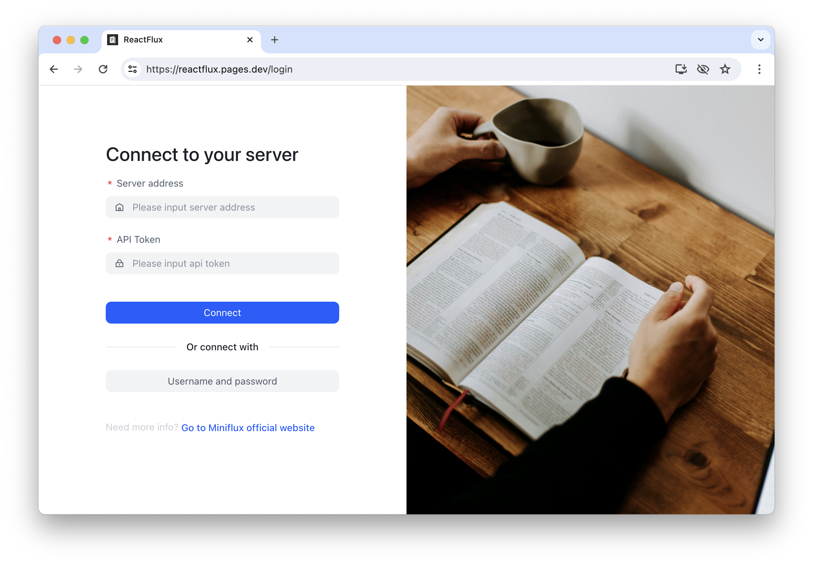
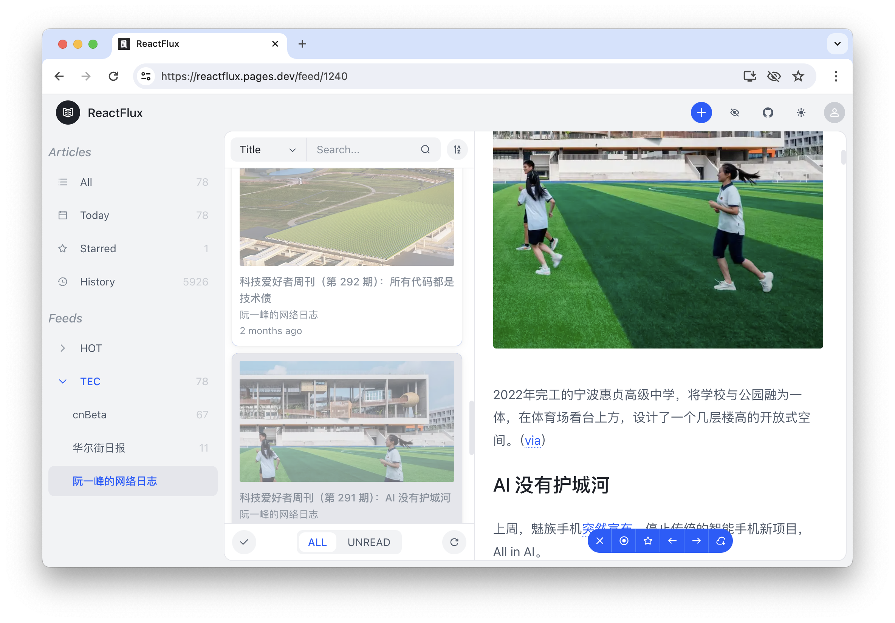
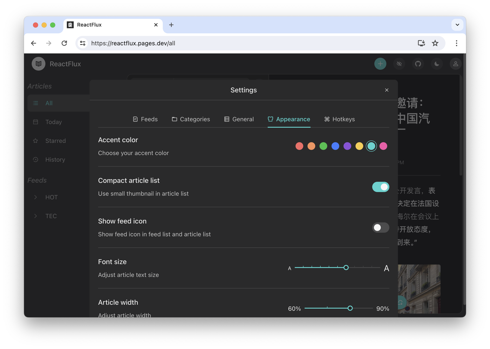

# ReactFlux

Read in other languages: [Español](README.es-ES.md), [简体中文](README.zh-CN.md)

## Overview

ReactFlux is a third-party web frontend for [Miniflux](https://github.com/miniflux/miniflux), aimed at providing a more user-friendly reading experience.

Key features include:

- Modern interface design
- Responsive layout
- Support for dark mode and custom themes
- Article search with Google-like syntax
- Feed and group management
- Keyboard shortcuts
- Automatically mark articles as read when scrolling
- Batch update the host of filtered subscription URLs (useful for replacing RSSHub instances)
- Batch refresh recently errored subscriptions
- De-duplicate articles by hash, title, or URL when loading the list
- I18n supports (include: English / Español / 简体中文)
- Save article to third-party services
- Other features waiting for you to discover...

## Screenshots





## Demo

[Online demo instance](https://reactflux.pages.dev/login)

## Deployment

### Cloudflare Pages

ReactFlux is built with React and generates a set of static web files after building, which can be directly deployed on Cloudflare Pages.

You can also deploy it on Cloudflare Pages yourself by selecting `Framework preset` as `Create React App`.

### Vercel

[](https://vercel.com/import/project?template=https://github.com/electh/ReactFlux)

### Zeabur

[](https://zeabur.com/templates/OKXO3W)

### Docker

```bash
docker run -p 2000:2000 electh/reactflux
```

## Configuration

You need a working Miniflux instance to use this project, and it supports the following two login methods:

1. Log in using the instance username and password (not recommended);
2. Log in using a Miniflux token, which can be generated in “Settings > API Keys > Create a new API key”.

## Branches

- `main` branch: Provides the most comprehensive features. New features are usually released on this branch first, suitable for most users.
- `next` branch: Initially created to improve mobile device compatibility, offering better experience and performance for mobile devices while also being compatible with desktop devices. This branch currently lacks features like keyboard shortcuts and will selectively migrate features from the `main` branch.
- `gh-pages` branch: Used for building and deploying the `main` branch to GitHub Pages.

If you want to quickly experience the `next` branch, here is an [online instance](https://arcoflux.pages.dev/login).

## Contributors

> Thanks to all the contributors who have made this project possible!

<table>
<tr>
    <td align="center">
        <a href="https://github.com/NekoAria">
            
        </a>
        <br />
        <sub><b>NekoAria</b></sub>
        <br />
        <sub><b> Main Contributor </b></sub>
    </td>
    <td align="center">
        <a href="https://github.com/electh">
            
        </a>
        <br />
        <sub><b>electh</b></sub>
        <br />
        <sub><b> Project Initiator </b></sub>
    </td>
</tr>
</table>

## Star History

[](https://starchart.cc/electh/ReactFlux)
```
