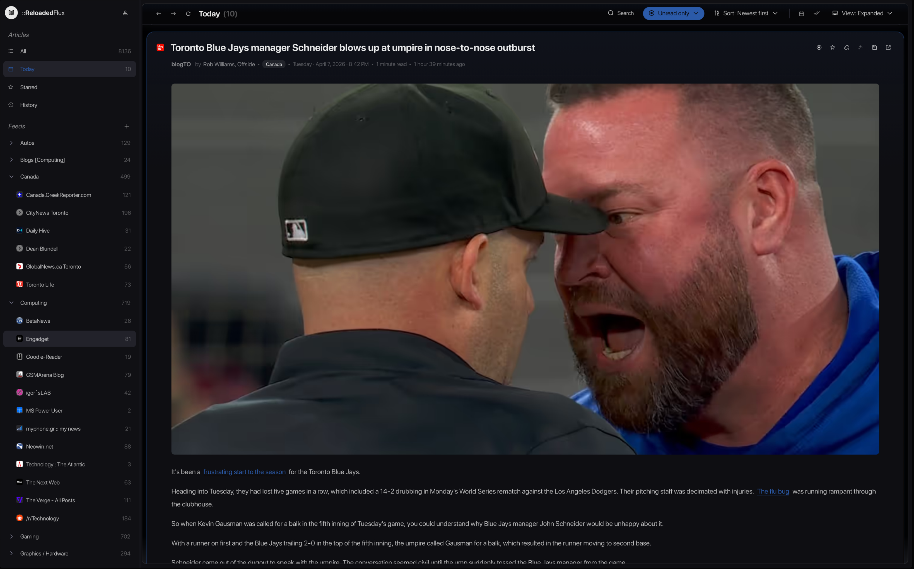
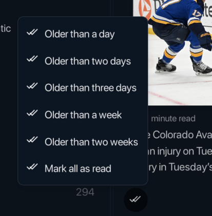
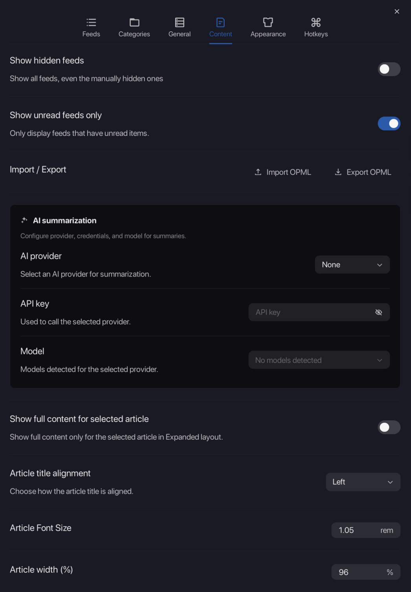
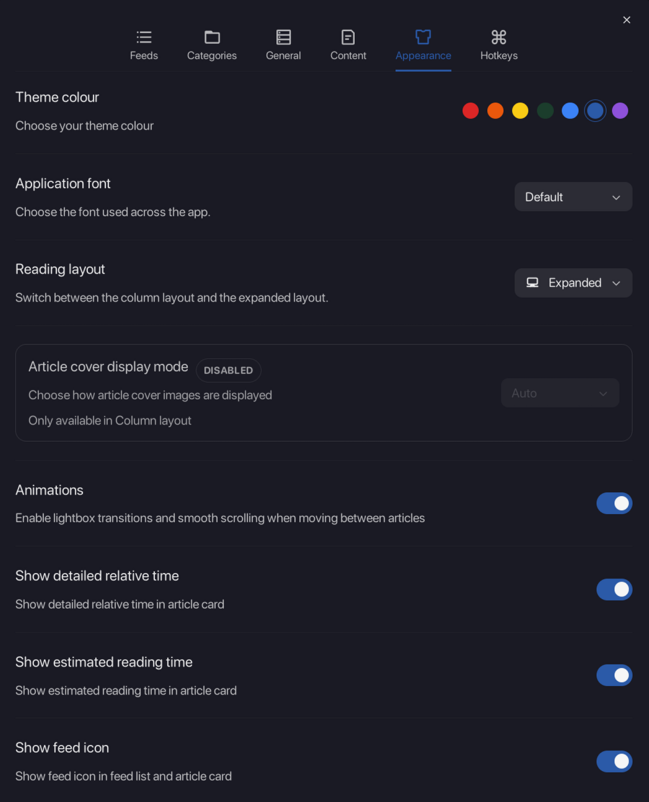
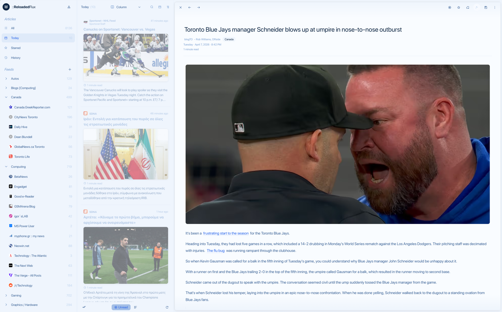

# ReloadedFlux

> [!IMPORTANT]  
> Used various LLMs as a playground for code generation and assistance in forking/structuring/coding the project.

This fork was initially created to add some stuff that I was sorely missing from the original excellent work the ReactFlux devs had already done. It now continues as ReloadedFlux, since the scope of the changes has expanded significantly. Here are some note worthy additions:

- A second layout option with a left sidebar for feeds and categories, and a right sidebar for article content. The original layout is still available as an option.
  

- Resizable panes
- Mark as read functionality based on days
  

- AI Summarization of articles
- New Content section contains old feed + article three dot menu options, plus new colour and global font setting for the whole app.
  
  

- Some theme changes I was applying with Tampermonkey up until now, with tweaks to colours, fonts and spacing.
  

- Various additional improvements, including Greek localization support and automatic feed refresh when clicking on feeds or categories.

This fork is my daily driver but it is bound to have bugs, so the usual apply; use at your own peril etc. For more info about the original project lineage, go read the upstream README contents from electh/ReactFlux:main.

# Installation

Just get the build branch contents and publish them in your favourite web server (yes, even Cloudflare Pages works). Then login with your Miniflux credentials and enjoy.
